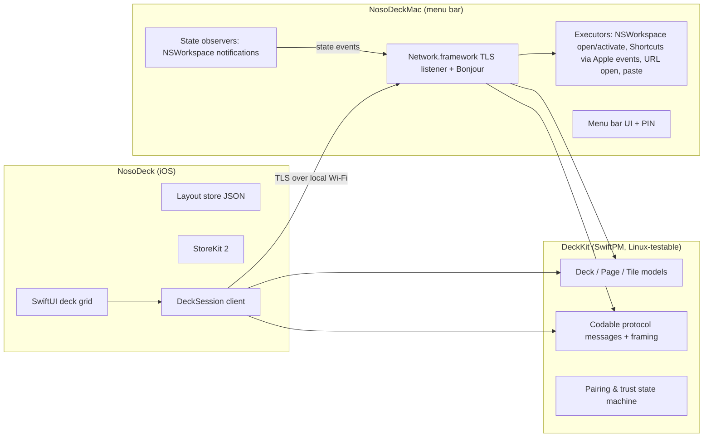

# NosoDeck — Product Requirements Document

Version 1.0 · 2026-08-11 · Sources: `docs/decisions.md` (D1–D13), `docs/research-choclift.md`

## 1. Overview

NosoDeck turns an iPhone into a live control deck for a Mac. The phone shows a grid of
tiles — Mac apps, Apple Shortcuts, and websites — and tapping a tile makes it happen on
the Mac instantly: the app comes to the front, the Shortcut runs, the site opens. Unlike
existing launchers (ChocLift), the deck is **live**: tiles continuously reflect what is
running and frontmost on the Mac. It is a public App Store product (iOS App Store +
Mac App Store), fully local-network with no cloud, free with a premium unlock.

## 2. Goals / Non-goals

### Goals (v1)
- One-tap launch / bring-to-front of Mac apps from an iPhone, with sub-second feedback (D4, D5).
- Live tile state: running / frontmost / not running, updated as the Mac changes (D4).
- Frictionless local pairing: discover via Bonjour, confirm via PIN, remember forever (D7).
- ChocLift feature parity that survives the Mac sandbox: Shortcuts tiles, URL tiles,
  recent-apps row, emoji/text insertion (D9).
- Shippable through both App Stores with a free tier + premium unlock (D1, D8, D10).

### Non-goals (v1) — from decisions.md
- Window management (min/max/snap) — requires Accessibility → v1.1 helper (D3).
- Shell/AppleScript action tiles — non-sandboxable → v1.1 helper (D3).
- System toggles (DND, dark mode, mic), media controls, system monitors — v1.1+.
- Multi-Mac pairing/switching; profiles that follow the frontmost app — v2.
- iPad-optimized grid, Apple Watch, visionOS — post-v1.
- Peer-to-peer transport fallback; cloud sync — not in v1 / not planned.

## 3. Personas & core user journeys

**P1 — The desk multitasker.** Works at a Mac all day with the iPhone on a stand beside
the keyboard. Wants app switching and repeated actions off the keyboard and into muscle
memory. Success: reaches for the phone deck without thinking.

**P2 — The automation tinkerer.** Has a library of Apple Shortcuts and wants physical
buttons for them without buying a Stream Deck. Success: their top 8 Shortcuts are one
tap away and fire reliably.

### Journey 1 — First run & pairing
1. User installs NosoDeck for Mac; it appears as a menu-bar icon and immediately
   advertises itself on the local network, showing a 6-digit PIN in its menu.
2. User installs NosoDeck on iPhone, opens it; the Mac appears by name in a device list
   within 3 seconds.
3. User taps the Mac, enters the PIN, and lands on a starter deck pre-filled with the
   Mac's Dock apps. Total time under two minutes, no accounts, no cloud.

### Journey 2 — Daily use
1. User unlocks the phone; the deck reconnects automatically within 2 seconds and tiles
   light up with current running/frontmost state.
2. Tapping a running app's tile brings it to the front on the Mac; tapping a closed
   app's tile launches it. The tile reflects the new state without user action.
3. User swipes between pages, taps a Shortcut tile to run an automation, taps a URL
   tile to open a dashboard in the browser.

### Journey 3 — Failure & reconnect
1. The Mac sleeps or the phone leaves Wi-Fi; the deck grays out with a "Reconnecting…"
   banner — tiles stay visible but inert.
2. When the Mac is reachable again, the session resumes without re-pairing and tiles
   refresh to live state.
3. If the Mac's identity ever changes (reinstall), the phone refuses silently trusting
   it and asks for the PIN again.

### Journey 4 — Going premium
1. Free user adds a second page or enables the recent-apps row; a paywall explains the
   premium unlock with a 7-day trial.
2. Purchase (StoreKit 2) unlocks immediately; layouts created during trial persist.

## 4. Feature requirements

Priorities: **P0** = v1 blocker · **P1** = v1 nice-to-have · **P2** = later.
Each cites its decision (D#).

### A. Pairing & connectivity (D7)
- **FR-1 (P0)** Mac agent advertises a Bonjour service (`_nosodeck._tcp`) whenever
  running. *Accept: with both devices on one Wi-Fi, the Mac appears in the iPhone's
  device list within 3 s of opening the app.*
- **FR-2 (P0)** Pairing requires entering the 6-digit PIN currently displayed on the
  Mac; success stores mutual trust (key pinning) on both sides. *Accept: wrong PIN is
  rejected with an error and no trust stored; correct PIN pairs; force-quitting and
  relaunching both apps reconnects with no PIN prompt.*
- **FR-3 (P0)** All traffic is TLS-encrypted; after pairing the phone only accepts the
  pinned Mac identity. *Accept: a different machine advertising the same name is shown
  as unpaired and prompts for PIN.*
- **FR-4 (P0)** Automatic reconnect: when the link drops, the deck shows a reconnecting
  state and resumes without user action once reachable. *Accept: toggling Mac Wi-Fi off
  for 10 s then on returns the deck to live state within 5 s of reachability, with no
  taps on the phone.*
- **FR-5 (P1)** Unpair from either side (phone settings / Mac menu), removing trust on
  the initiating device. *Accept: after unpairing, connecting again requires the PIN.*

### B. Deck & tiles (D4, D5, D6, D13)
- **FR-6 (P0)** The deck is a fixed grid (4 columns; rows fit the device) of tiles;
  layout is edited on the iPhone: add, remove, and reorder via drag. *Accept: a
  reordered layout survives app relaunch.*
- **FR-7 (P0)** App tiles show the real Mac app icon and name, served by the agent.
  *Accept: adding any installed Mac app shows its actual icon within 2 s.*
- **FR-8 (P0)** The agent provides a searchable catalog of installed apps (from
  `/Applications` + Dock) for the phone's "add tile" flow. *Accept: searching "saf"
  lists Safari.*
- **FR-9 (P0)** Tapping an app tile activates the app on the Mac: launches it if
  closed, brings it to front if running. *Accept: tap-to-front completes in under 1 s
  on the same network; tap-to-launch shows the app opening.*
- **FR-10 (P0)** Live status: each app tile shows a running indicator and a distinct
  frontmost highlight, driven by Mac events. *Accept: launching or switching apps on
  the Mac by hand updates the phone's tiles within 1 s, without touching the phone.*
- **FR-11 (P1)** Swipe-down on a running app tile quits that app (graceful terminate;
  never force-kill). *Accept: swipe quits a clean app; an app with unsaved changes may
  show its own save dialog on the Mac — the tile then still shows it running.*
- **FR-12 (P0)** Starter deck: first pairing pre-fills page 1 with the Mac's Dock apps
  (up to grid capacity). *Accept: a fresh pair shows a non-empty deck.*

### C. Action tiles (D9)
- **FR-13 (P0)** Shortcuts tiles: the agent lists the Mac's Apple Shortcuts; the user
  adds one as a tile with a custom emoji/label; tapping runs it on the Mac. *Accept: a
  Shortcut that shows a notification fires it when its tile is tapped.*
- **FR-14 (P0)** URL tiles: user enters a URL + name on the phone; tapping opens it in
  the Mac's default browser. *Accept: tapping opens the exact URL frontmost.*
- **FR-15 (P1)** Emoji/text insertion: an emoji strip on the phone inserts the tapped
  emoji into the Mac's active text field via pasteboard + synthetic ⌘V, gated on the
  user granting the agent Accessibility permission; without the grant, the emoji is
  placed on the clipboard and the Mac shows a "press ⌘V" notification. *Accept: with
  permission granted, tapping 🎉 while TextEdit is focused types 🎉; without it, 🎉 is
  on the clipboard and the notification appears. Prior clipboard contents are restored
  within 1 s after insertion.*

### D. Recent apps (D9, D10)
- **FR-16 (P1, premium)** A horizontally scrollable recents row shows the Mac's
  recently activated apps, most recent first, deduplicated, excluding the agent itself;
  tapping activates. *Accept: activating three apps on the Mac shows them in that
  order on the phone within 2 s.*

### E. Pages & premium (D8, D10)
- **FR-17 (P0)** Free tier: one deck page with full live functionality. Premium: up to
  8 pages, the recents row, and icon themes. *Accept: a free user tapping "add page"
  hits the paywall; nothing already free is ever locked.*
- **FR-18 (P0)** StoreKit 2 purchase flow with 7-day trial, restore purchases, and
  graceful offline behavior (entitlement cached). *Accept: sandbox-account purchase
  unlocks pages immediately; "Restore" recovers it after reinstall.*

### F. Mac agent UX (D2, D3, D13)
- **FR-19 (P0)** The agent is a menu-bar-only app (no Dock icon) showing: connection
  state, paired device name, the PIN when unpaired, and Quit. *Accept: menu reflects
  paired/unpaired state correctly after pair and unpair.*
- **FR-20 (P0)** The agent starts at login (SMAppService, user-visible toggle).
  *Accept: after enabling and rebooting, the menu-bar icon is present without launching
  anything.*

### G. iOS UX polish (D6, D9)
- **FR-21 (P1)** Haptic feedback on tile tap; the screen stays awake while the deck is
  foregrounded and connected. *Accept: idle timer disabled only while connected.*
- **FR-22 (P1)** Onboarding: a 2-screen explainer (install Mac app → pair) with a link
  to the Mac App Store listing. *Accept: shown only when no Mac has ever been paired.*

## 5. System architecture

Three build products in one repo:

| Target | Kind | Platform | Role |
|---|---|---|---|
| `DeckKit` | SwiftPM library | iOS 17+, macOS 14+, Linux (tests) | Models, protocol messages, framing, pairing state machine — all pure logic, fully unit-tested |
| `NosoDeck` | iOS app (SwiftUI) | iOS 17+ | Deck UI, discovery + session client, layout persistence, StoreKit |
| `NosoDeckMac` | macOS app (SwiftUI menu bar) | macOS 14+ | Bonjour advertiser + TLS listener, action executors, state observers |

Xcode projects are generated from committed `project.yml` files via XcodeGen
(`brew install xcodegen && xcodegen`) so the repo stays merge-friendly and the Linux
agent can edit build config as text.

### Protocol (owned by DeckKit)

Length-prefixed JSON frames over TLS; every message carries `v` (protocol version) and
`id` (for request/response correlation). Message types:

- `hello` / `helloAck` — capability + version negotiation.
- `pairRequest{pin}` / `pairResult{accepted, agentIdentity}` — PIN check, key pinning.
- `catalogRequest{query?}` / `catalog{apps: [bundleID, name, iconPNGHash]}` and
  `iconRequest{hash}` / `icon{hash, pngData}` — icons cached by hash on the phone.
- `shortcutsRequest` / `shortcuts{names}`.
- `action{kind: activateApp|quitApp|runShortcut|openURL|insertText, payload}` /
  `actionResult{id, ok, error?}`.
- `stateEvent{running: [bundleID], frontmost: bundleID, recents: [bundleID]}` — pushed
  by the Mac on every change and on subscribe.
- `ping` / `pong` — 10 s keepalive; 2 misses ⇒ reconnect state.

### Persistence
- Deck layout: versioned Codable JSON in the iOS app's Application Support (models in
  DeckKit so the Mac can render/edit later).
- Trust: pinned peer public keys + device identity in each platform's Keychain.
- Premium entitlement: StoreKit 2 current-entitlement, cached.

### Permission / entitlement plan (Mac agent, all MAS-legal)
- App Sandbox **on**; `com.apple.security.network.server` + `.network.client`;
  local-network privacy string (also on iOS).
- `com.apple.security.automation.apple-events` + `NSAppleEventsUsageDescription` —
  drive Shortcuts via Shortcuts Events (user consents once).
- Accessibility trust requested **only** when the user enables emoji insertion (FR-15);
  every other feature works without it.

## 6. Platform constraints

- iOS 17+ / macOS 14+ (D6); Swift 5.10+, SwiftUI + Observation everywhere.
- Both apps ship through their App Stores (D1); the Mac agent is sandboxed (D3) —
  every v1 feature above is chosen to be sandbox-survivable.
- No cloud services of any kind; the only network traffic is phone↔Mac TLS (D7).
- Development happens in a Linux container: DeckKit is built/tested with `swift test`
  there; app targets are verified by the owner in Xcode per `docs/VERIFY.md` (D12).

## 7. Milestones

Sized for `/implementation-loop`: each is independently buildable and verifiable.

- [ ] **M0 — Scaffolding.** Repo layout, DeckKit package skeleton building green on
  Linux, XcodeGen specs for both apps, `docs/VERIFY.md` template, CI-less build docs.
  Delivers: foundations. *Verify: `swift build`/`swift test` on Linux; owner runs
  `xcodegen` and both apps build empty in Xcode.*
- [ ] **M1 — Protocol & pairing core (DeckKit).** Models, framing codec, all message
  types, pairing/trust state machine, session state machine with keepalive rules.
  Delivers: FR-2/3/4 logic. *Verify: unit tests on Linux incl. fuzz-ish framing tests.*
- [ ] **M2 — Mac agent MVP.** Menu bar app, Bonjour advertise, TLS listener, PIN
  display, pairing handshake, Keychain trust store. Delivers: FR-1, FR-2, FR-3, FR-19.
  *Verify: owner pairs from the M3 phone build (or the included CLI test client).*
- [ ] **M3 — iOS app MVP.** Discovery list, PIN entry, session client, reconnect
  banner, empty deck shell. Delivers: FR-1–FR-4 end-to-end, FR-22 skeleton.
  *Verify: owner pairs phone↔Mac; kills Wi-Fi and watches auto-reconnect.*
- [ ] **M4 — App tiles & activation.** Catalog + icons, add/reorder/remove tiles,
  starter deck from Dock, tap-to-activate. Delivers: FR-6, FR-7, FR-8, FR-9, FR-12.
  *Verify: owner manual script in VERIFY.md.*
- [ ] **M5 — Live status.** NSWorkspace observers → stateEvent stream → tile
  indicators; quit-on-swipe. Delivers: FR-10, FR-11. *Verify: DeckKit diff-logic unit
  tests + owner's 1-second-update check.*
- [ ] **M6 — Shortcuts & URL tiles.** Shortcuts listing + run via Apple events with
  consent flow; URL tiles. Delivers: FR-13, FR-14. *Verify: owner runs a notification
  Shortcut from the deck.*
- [ ] **M7 — Pages & premium.** Multi-page deck, StoreKit 2 paywall + trial + restore,
  free/premium gating. Delivers: FR-17, FR-18. *Verify: StoreKit configuration file
  sandbox testing in Xcode by owner.*
- [ ] **M8 — Recents & emoji.** Recents row (premium); emoji strip with Accessibility
  opt-in and clipboard fallback. Delivers: FR-15, FR-16. *Verify: owner manual script.*
- [ ] **M9 — Polish & submission prep.** Haptics, keep-awake, unpair flows, login item,
  onboarding, privacy strings, App Store metadata checklist. Delivers: FR-5, FR-20,
  FR-21, FR-22. *Verify: full VERIFY.md pass by owner on clean devices.*

## 8. Risks & open questions

| Risk / open item | Impact | Mitigation / owner |
|---|---|---|
| Final bundle-ID domain (placeholder `com.noso.nosodeck`) | Blocks App Store submission, not code | Owner confirms developer-account domain before M9 |
| Premium price point & sub-vs-one-time | Blocks submission, not code | Owner decides during M7 |
| App Review on local-network control apps | Rejection risk | Follow ChocLift precedent: clear privacy strings, local-only claim, demo video for review notes |
| Synthetic ⌘V (FR-15) may behave inconsistently across apps | Feature flakiness | Shipped as opt-in P1 with clipboard fallback; can be cut without touching P0 |
| `NSRunningApplication.terminate()` behavior from sandbox (FR-11) | Quit gesture may need Apple-events fallback | P1; verify in M5 on real hardware, fall back to Apple events `quit` |
| Shortcuts enumeration inside sandbox | May need Shortcuts Events instead of CLI | Design already targets Apple events; verify in M6 |
| Owner-in-the-loop verification cadence (D12) | Milestones can stack unverified | VERIFY.md keeps an explicit pending-verification queue |
